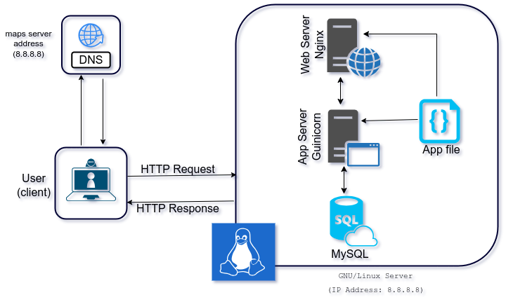

# Simple Web Stack

Welcome to the Foobar.com web infrastructure! This document will explain the key components of our web setup, how they work together, and potential issues you should be aware of.

## Table of Contents
1. [Overview](#overview)
2. [Components](#components)
3. [Infrastructure Specifics](#infrastructure-specifics)
4. [Issues](#issues)

## 1. Overview 

Imagine a user who wants to access our website, foobar.com. To make this happen, we've set up a web infrastructure that includes a server, web server (Nginx), application server, application code base, database (MySQL), and a domain name configuration.

## 2. Components 

### 2.1 Server

A **server** is a powerful computer that stores and serves web content. It hosts the web and application servers, along with the database. Think of it as the backbone of our infrastructure.

### 2.2 Domain Name

The **domain name** (foobar.com) is the human-readable address users enter in their web browsers to access our website. It serves as a user-friendly way to find our server on the internet.

### 2.3 DNS Record (www)

The **www** in www.foobar.com represents a DNS (Domain Name System) record. It's an alias that points to the server's IP address (8.8.8.8). This allows users to access our website using both "foobar.com" and "www.foobar.com."

### 2.4 Web Server (Nginx)

The **web server (Nginx)** plays a crucial role. It receives user requests, forwards them to the application server, and then serves web pages back to the users. It can also handle tasks like load balancing and SSL termination.

### 2.5 Application Server

The **application server** is where our application code base resides. It processes user requests, interacts with the database, and generates dynamic content to be sent back through the web server to the user's browser.

### 2.6 Database (MySQL)

The **database** is where we store and manage data for our web application. MySQL is a popular relational database management system used for this purpose.

## 3. Infrastructure Specifics 

Now, let's delve into some specifics about this infrastructure:

- **What is a server?** A server is a high-powered computer that hosts our web, application, and database servers.

- **What is the role of the domain name?** The domain name (foobar.com) is the address users use to find our server. It's essential for user-friendly access.

- **What type of DNS record is www in www.foobar.com?** It's a CNAME (Canonical Name) record that points to the server's IP address.

- **What is the role of the web server?** Nginx, our web server, handles user requests, forwards them to the application server, and serves web pages to users. It also performs load balancing and SSL termination.

- **What is the role of the application server?** The application server executes the code that powers our website, interacts with the database, and generates dynamic content.

- **What is the role of the database?** The database (MySQL) stores and manages data for our web application.

- **How does the server communicate with the user's computer?** The server communicates with the user's computer over the internet using the HTTP (Hypertext Transfer Protocol) when the user requests our website.

## 4. Issues 

While our infrastructure is well-structured, there are some potential issues to be aware of:

- **Single Point of Failure (SPOF)**: If our server fails, the entire website will be inaccessible. Implementing redundancy and failover solutions can mitigate this risk.

- **Downtime During Maintenance**: When we need to perform maintenance tasks, such as deploying new code that requires the web server to be restarted, the website may experience downtime. Proper scheduling and redundancy can help minimize this.

- **Limited Scalability**: If we experience a sudden influx of traffic, our infrastructure may struggle to handle it. We should consider scaling options, like adding more servers or utilizing a content delivery network (CDN), to accommodate high traffic loads.
