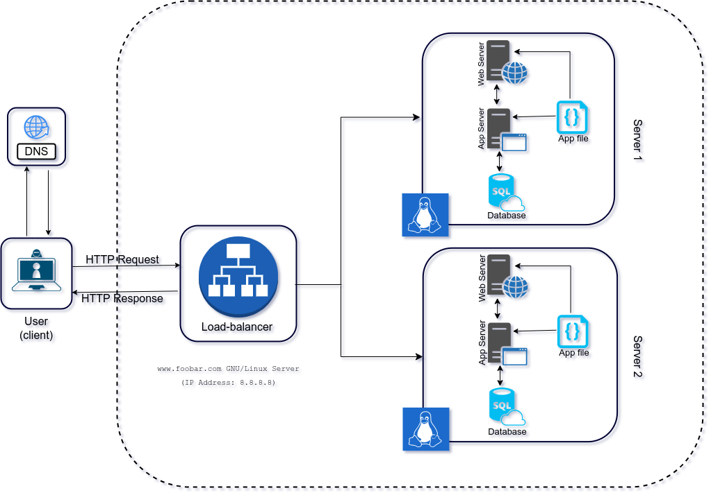

# Distributed Web Infrastructure

Welcome to our robust and scalable web infrastructure! This document outlines the architecture, explains the rationale for each component, and addresses potential issues that need consideration.

## Table of Contents
1. [Overview](#overview)
2. [Components](#components)
3. [Infrastructure Specifics](#infrastructure-specifics)
4. [Issues](#issues)

## 1. Overview 

Our goal is to provide a highly available, performant, and secure web infrastructure. To achieve this, we've designed a comprehensive setup that includes servers, a web server (Nginx), an application server, a load balancer (HAproxy), a set of application files (our code base), and a MySQL database.

## 2. Components 

### 2.1 Servers (2)

We've added two servers to ensure redundancy and fault tolerance. If one server goes down, the other can take over, reducing the risk of a single point of failure (SPOF).

### 2.2 Web Server (Nginx)

Nginx is responsible for handling incoming web requests, serving static content, and acting as a reverse proxy to distribute requests to the application servers. It helps improve performance and security.

### 2.3 Application Server

The application server executes our code base, generates dynamic content, and interacts with the database. It ensures the proper functioning of our web application.

### 2.4 Load Balancer (HAproxy)

The load balancer (HAproxy) evenly distributes incoming traffic across multiple application servers. This provides load balancing, enhances reliability, and allows for horizontal scaling. The distribution algorithm is discussed in the next section.

### 2.5 Application Files (Code Base)

Our application files contain the code and assets required to run our web application.

### 2.6 Database (MySQL)

The database (MySQL) stores and manages our data. It's critical for the operation of our web application.

## 3. Infrastructure Specifics 

### Additional Elements

- **Two Servers**: To achieve redundancy and high availability.
- **Load Balancer (HAproxy)**: To evenly distribute traffic, enhance reliability, and facilitate scaling.
- **Application Files**: To run our web application.
- **MySQL Database**: To store and manage data.

### Load Balancer Distribution Algorithm

Our load balancer (HAproxy) is configured with a Round Robin distribution algorithm. It works by sequentially routing incoming requests to each available application server in a circular order. This ensures an even distribution of requests.

### Active-Active vs. Active-Passive Setup

Our load balancer is configured for an Active-Active setup. In an Active-Active setup, all servers are actively serving traffic simultaneously, effectively sharing the load. This differs from an Active-Passive setup, where one server is actively serving traffic while others remain on standby for failover purposes.

### Database Primary-Replica (Master-Slave) Cluster

Our MySQL database is set up as a Primary-Replica (Master-Slave) cluster. In this configuration, the Primary node is responsible for both read and write operations. The Replica node(s) replicate data from the Primary and serve read-only operations. This provides redundancy and fault tolerance.

### Difference Between Primary and Replica Nodes

- **Primary Node**: Handles both read and write operations. It is the authoritative source for data.
- **Replica Node**: Replicates data from the Primary and serves read-only operations. It provides fault tolerance and can offload read traffic from the Primary.

## 4. Issues 

Our infrastructure is robust, but there are some issues that need attention:

- **Single Points of Failure (SPOF)**: While we have redundancy in our server setup, a single point of failure exists in our database if the Primary goes down. Implementing failover mechanisms can address this issue.
- **Security Issues**: Our infrastructure lacks a firewall and HTTPS, leaving it vulnerable to security threats. Implementing a firewall and enabling HTTPS are essential for data protection.
- **No Monitoring**: We currently lack monitoring tools to track system performance and security. Implementing monitoring solutions will help identify issues proactively and maintain a healthy infrastructure.
