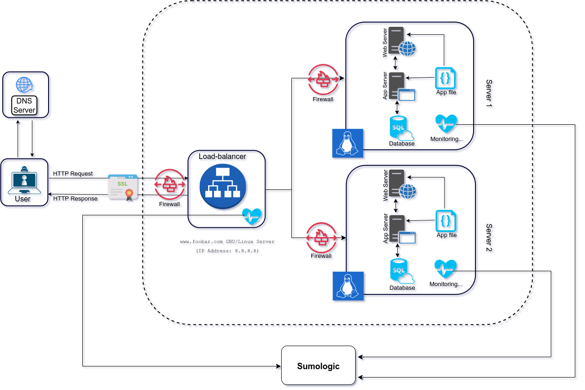

# Secured and Monitored Web Infrastructure

Welcome to the advanced and secure web infrastructure for www.foobar.com! This document provides insights into our architecture, justifications for each component, and highlights potential issues that need to be addressed.

## Table of Contents
1. [Overview](#overview)
2. [Components](#components)
3. [Infrastructure Specifics](#infrastructure-specifics)
4. [Issues](#issues)

## 1. Overview 

Our primary goal is to provide a highly secure, robust, and monitored web infrastructure. To achieve this, we've designed an infrastructure that includes firewalls, SSL certificate integration for HTTPS, and monitoring clients.

## 2. Components 

### 2.1 Firewalls (3)

We've added three firewalls to our infrastructure for enhanced security. Firewalls act as barriers to filter incoming and outgoing network traffic. They help protect our servers and data from unauthorized access and potential threats.

### 2.2 SSL Certificate

We have integrated an SSL certificate to serve www.foobar.com over HTTPS. This certificate ensures secure and encrypted communication between users and our web servers, safeguarding data in transit and building trust with our users.

### 2.3 Monitoring Clients (Data Collectors)

We've incorporated three monitoring clients, which act as data collectors for Sumo Logic or other monitoring services. These clients collect performance and security data from our infrastructure, enabling real-time monitoring, analysis, and proactive issue resolution.

## 3. Infrastructure Specifics 

### Additional Elements

- **Firewalls (3)**: Added for enhanced security to filter and protect against unauthorized network traffic.
- **SSL Certificate**: Enables secure, encrypted communication (HTTPS) to protect data in transit and establish trust.
- **Monitoring Clients**: Gather and transmit data to monitoring services for real-time performance and security analysis.

### The Role of Firewalls

Firewalls are essential for controlling network traffic. They act as gatekeepers, enforcing security policies to block malicious traffic, prevent unauthorized access, and safeguard our infrastructure.

### HTTPS for Traffic

Serving traffic over HTTPS is crucial for security. It encrypts data in transit, preventing eavesdropping and data tampering. It also builds trust with users, as they see the padlock icon in the browser's address bar.

### Monitoring's Purpose

Monitoring is used for real-time tracking of infrastructure performance and security. It helps detect anomalies, troubleshoot issues, and ensure our services are available and responsive to users.

### Data Collection by Monitoring Tools

Monitoring tools, like Sumo Logic, rely on monitoring clients (data collectors) to gather data. These clients extract relevant metrics from various parts of our infrastructure and transmit the data to the monitoring service. This information is then processed and visualized for analysis.

### Monitoring Web Server QPS

To monitor the web server's Query Per Second (QPS), you can set up specific metrics within the monitoring tool. Configure the tool to track HTTP requests or any other relevant metric that represents the server's query load. The monitoring service will then collect and display this data for analysis.

## 4. Issues 

While our infrastructure is robust, there are some issues to address:

- **Terminating SSL at the Load Balancer Level**: Terminating SSL at the load balancer can expose traffic in an unencrypted form within the internal network. It's recommended to use end-to-end encryption to ensure data remains encrypted throughout the entire communication process.

- **Single MySQL Server Capable of Accepting Writes**: Relying on a single MySQL server for write operations is a potential SPOF. Implementing a High Availability (HA) configuration, such as Master-Master replication or clustering, is essential for redundancy and fault tolerance.

- **Servers with All the Same Components**: Using servers with identical components can lead to uniformity issues. If one component fails, it can impact all servers in the same way. Diversifying components or introducing different server roles can improve fault tolerance and performance.
