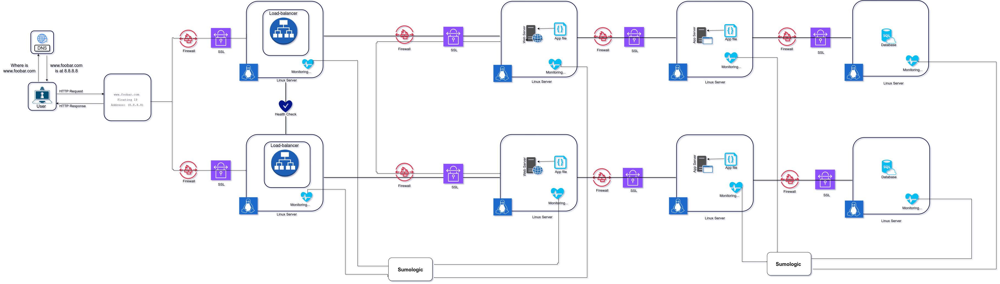

# Scaled up Web Infrastructure

Welcome to our simplified web infrastructure. In this version, all SPOFs have been removed and each of the major components (web server, application server, and database servers) have been moved to separate GNU/Linux servers. The SSL protection isn't terminated at the load-balancer and each server's network is protected with a firewall and they're also monitored.

## Table of Contents
1. [Overview](#overview)
2. [Components](#components)
3. [Infrastructure Specifics](#infrastructure-specifics)
4. [Issues](#issues)

## 1. Overview 

Our aim is to create a more organized and efficient web infrastructure. To achieve this, we've set up a server, a load balancer (HAproxy) configured as a cluster, and split our components (web server, application server, database) onto their dedicated servers.

## 2. Components 

### 2.1 Server (1)

We have one server that acts as the backbone of our infrastructure. It hosts the web server, application server, and the database.

### 2.2 Load Balancer (HAproxy)

The load balancer (HAproxy) is configured as a cluster with another HAproxy instance. It balances incoming web traffic across our web server instances, ensuring even distribution and improved availability.

### 2.3 Web Server, Application Server, Database

We've separated the web server, application server, and database onto their individual servers for better resource isolation, scalability, and easier management.

## 3. Infrastructure Specifics 

### The Purpose of Each Component

- **Server**: The server is the foundation of our infrastructure, hosting all key components. It provides a centralized point of control and management.

- **Load Balancer (HAproxy)**: Configured as a cluster with redundancy to evenly distribute incoming traffic across multiple web servers. This enhances availability and ensures no single point of failure for load balancing.

- **Split Components (Web Server, Application Server, Database)**: We've divided these components to improve resource allocation, scalability, and ease of maintenance. This separation allows us to allocate resources efficiently and scale each component individually based on its unique requirements.

By splitting components, we can isolate potential issues and scale more flexibly in response to varying demands. The load balancer ensures even distribution, and the server acts as a centralized point for management and control. This architecture provides a foundation for a more robust and organized web infrastructure.

## 4. Issues 

While our infrastructure is designed for efficiency and scalability, there are potential issues to consider:

- **Complexity of Configuration**: Managing and configuring multiple components can become complex and require careful synchronization.

- **Resource Allocation**: Splitting components onto separate servers allows for efficient resource allocation, but it also requires careful monitoring and management to ensure resources are distributed optimally.
